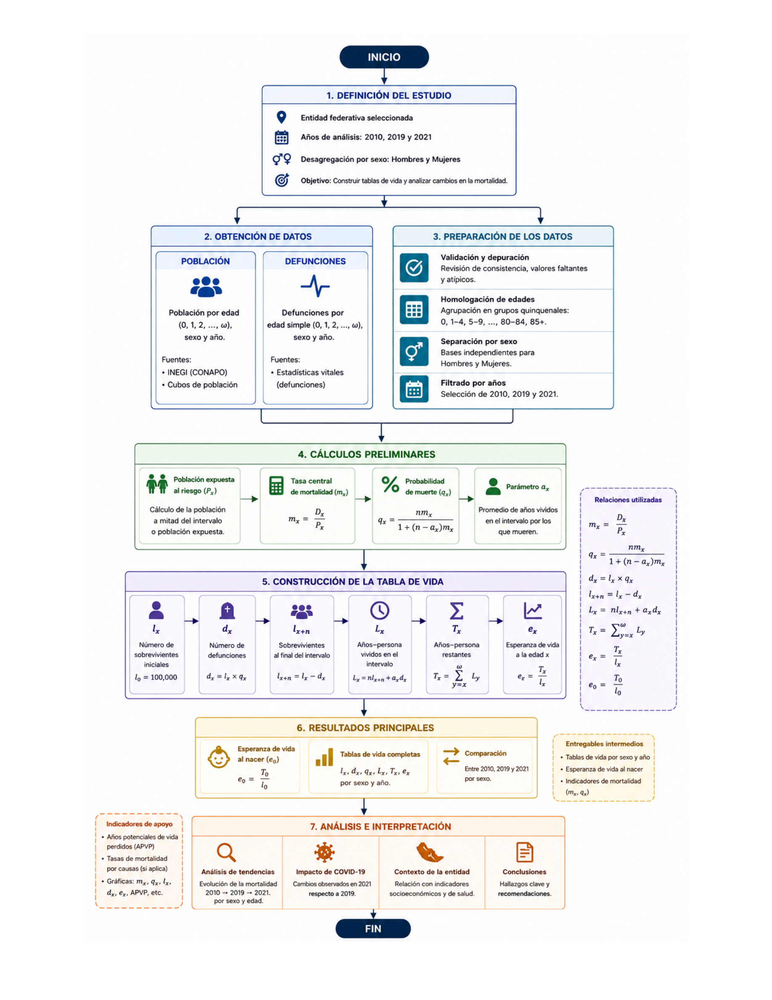

```{r}
#| label: setup
#| include: false

library(readxl)
library(data.table)
library(ggplot2)
library(dplyr)
library(tidyr)
library(kableExtra)
library(lubridate)
library(knitr)


proyecto_dir <- "C:/Users/vivim/OneDrive/Desktop/Demografia Jalisco/Demography/Jalisco-Demography"
ruta_base <- file.path(proyecto_dir, "data/raw/")
ruta_output <- file.path(proyecto_dir, "output/")

posibles_rutas_rds <- c(
  file.path(ruta_output, "tablas/tablas_vida_completas.rds"),
  "output/tablas/tablas_vida_completas.rds",
  "../output/tablas/tablas_vida_completas.rds",
  "tablas_vida_completas.rds"
)

tablas_vida_cargada <- FALSE
for (ruta in posibles_rutas_rds) {
  if (file.exists(ruta)) {
    tablas_vida <- readRDS(ruta)
    tablas_vida_cargada <- TRUE
    break
  }
}
```

##### a)

# Introducción

La tabla de vida es una de las herramientas más importantes en la demografía y la práctica actuarial. Su objetivo principal es medir los riesgos de fallecimiento y la esperanza de vida de una población en diferentes edades, aislando el efecto de la estructura por edad. El análisis de estos indicadores es fundamental para el diseño de políticas de salud pública, la planeación de la seguridad social y la valuación de sistemas de pensiones.

El estado de Jalisco es una de las entidades más pobladas y dinámicas de México, con más de 8.3 millones de habitantes según el Censo de 2020. Sin embargo, la distribución de su población es muy desigual: más de la mitad de los jaliscienses vive en la Zona Metropolitana de Guadalajara. Esto genera diferencias importantes en las condiciones de vida y en el acceso a los servicios de salud entre las áreas urbanas y las rurales.

A nivel epidemiológico, la mortalidad en Jalisco está determinada por dos factores principales. Por un lado, las enfermedades crónico-degenerativas (como la diabetes y las enfermedades cardíacas) afectan principalmente a los adultos mayores. Por otro lado, las causas externas, asociadas a la violencia y los homicidios, generan una fuerte sobremortalidad masculina que impacta sobre todo a los hombres jóvenes en edades productivas. A esto se suma el impacto coyuntural de la pandemia de COVID-19 en el año 2021.

El **objetivo de este proyecto** es construir y analizar de manera comparativa las tablas de vida abreviadas para el estado de Jalisco correspondientes a los años 2010, 2019 y 2021. A partir de los microdatos oficiales de defunciones y censos del INEGI y CONAPO , se calcularon las funciones actuariales básicas ($l_x$, $d_x$, $m_x$, $q_x$, $e_x$) utilizando el método de Coale-Demeny para corregir la mortalidad en las primeras edades. Asimismo, se determinaron los Años Potenciales de Vida Perdidos (APV) para cuantificar el impacto de las muertes prematuras. Con esto, se busca evaluar la evolución de la longevidad en el estado, identificar las brechas por sexo y analizar las limitaciones de los registros administrativos frente a crisis sanitarias severas.

# Diagrama de Flujo

```{r}
#| echo: false
#| fig.align: "center"
#| out.width: "85%"
#| fig.pos: "H"
#| fig.cap: "Diagrama de flujo del proceso de construcción de tablas de vida"


```

Fuente: Elaboración propia.

# Fórmulas utilizadas

## Tasa específica de mortalidad

$$
_n m_x = \frac{_nD_x}{_nN_x}
$$

## Probabilidad de morir entre las edades $x$ y $x+n$

$$
_n q_x = \frac{n \cdot _n m_x}{1 + (n - _n a_x) \cdot _n m_x}
$$

## Coeficientes $a_x$ (método de Coale-Demeny)

Para la edad 0 (primer año de vida):

$$
a_0 = \begin{cases} 
0.330 & \text{si } m_0 \ge 0.107 \text{ (hombres)} \\ 
0.350 & \text{si } m_0 \ge 0.107 \text{ (mujeres)} \\ 
0.045 + 2.684 \cdot m_0 & \text{si } m_0 < 0.107 \text{ (hombres)} \\ 
0.053 + 2.800 \cdot m_0 & \text{si } m_0 < 0.107 \text{ (mujeres)}
\end{cases}
$$

Para el grupo de 1 a 4 años:

$$
a_1 = \begin{cases}
1.352 & \text{si } m_0 \ge 0.107 \text{ (hombres)} \\
1.361 & \text{si } m_0 \ge 0.107 \text{ (mujeres)} \\
1.651 - 2.816 \cdot m_0 & \text{si } m_0 < 0.107 \text{ (hombres)} \\
1.522 - 1.518 \cdot m_0 & \text{si } m_0 < 0.107 \text{ (mujeres)}
\end{cases}
$$

Para el resto de grupos de edad (excepto el último): $_na_x = n/2$

## Sobrevivientes

$$
l_{x+n} = l_x \cdot (1 - _nq_x), \quad l_0 = 100,000
$$

## Años persona vividos

Para grupos cerrados ($n$ finito):

$$
L_x = n \cdot l_{x+n} + _na_x \cdot _nd_x
$$

Para el último grupo abierto:

$$
L_{\omega} = \frac{l_{\omega}}{m_{\omega}}
$$

## Esperanza de vida

$$
e_x = \frac{T_x}{l_x}, \quad T_x = \sum_{i=x}^{\omega} L_i
$$

## Crecimiento exponencial (para estimación de población intercensal)

$$
P(t) = P_0 \cdot e^{rt}, \quad r = \frac{\ln(P_t/P_0)}{t - t_0}
$$

## Tasa Global de Fecundidad (TGF):

Representa el número promedio de hijos que tendría una mujer de una cohorte hipotética si rigieran las tasas específicas de fecundidad por edad ($TEF_x$) del año en cuestión en intervalos quinquenales ($n=5$): $$TGF = 5 \times \sum_{x=15}^{45} TEF_x = 5 \times \sum_{x=15}^{45} \frac{B_x}{W_x}$$ *Donde* $B_x$ representa los nacimientos ocurridos de madres en el grupo de edad $x$ a $x+4$ (corregidos por extremos y no especificados) y $W_x$ es la población femenina media expuesta al riesgo ($l_x$ de la tabla de vida).

## Tasa Bruta de Reproducción (TBR):

Mide el número promedio de hijas (mujeres) que nacerían de una cohorte de mujeres siguiendo las tasas de fecundidad vigentes, asumiendo que ninguna madre muere antes de terminar su periodo reproductivo: $TBR = 5 \times \sum_{x=15}^{45} \left( TEF_x \times k \right)$ *Donde* $k$ es el factor biológico de masculinidad estándar equivalente a $\frac{100}{205} \approx 0.4878$.

## Tasa Neta de Reproducción (TNR):

Evalúa el número promedio de hijas sobrevivientes que dejará una mujer, incorporando formalmente el riesgo de mortalidad de las madres mediante la función actuarial de supervivencia de nuestra tabla de vida de Jalisco: $TNR = 5 \times \sum_{x=15}^{45} \left( TEF_x \times k \times \frac{l_x}{l_0} \right)$ *Donde* $\frac{l_x}{l_0}$ representa la probabilidad de que una recién nacida sobreviva hasta el intervalo de edad fértil, tomando un radix $l_0 = 100,000$.

## Demostración de la Tasa de Reemplazo (2.1 hijos por mujer) b)

La tasa de reemplazo es el nivel de fecundidad que permite que una población se reemplace a sí misma a largo plazo, en ausencia de migración.

Relación de masculinidad al nacer (Sex Ratio at Birth - SRB)

En condiciones normales, nacen aproximadamente 105 hombres por cada 100 mujeres:

$$SRB = \frac{105}{100} = 1.05 $$

Proporción de nacimientos femeninos

La proporción de nacimientos que son mujeres es:

$$k = \frac{1}{1 + SRB} = \frac{1}{2.05} = \frac{100}{205} \approx 0.4878$$

Relación entre Tasa Bruta de Reproducción (TBR) y Tasa Global de Fecundidad (TGF)

La Tasa Bruta de Reproducción mide el número promedio de hijas por mujer:

$TBR = TGF \times k = TGF \times 0.4878$

Despejando:

$TGF = \frac{TBR}{0.4878} = TBR \times 2.05$

Condición de reemplazo poblacional

Para que la población se reemplace a largo plazo, se necesita que la **Tasa Neta de Reproducción (TNR)** sea igual a 1:

$$TNR = TBR \times p(A) = 1 $$

Donde: $$p(A)$$ es la probabilidad de que una mujer sobreviva desde el nacimiento hasta el final de su vida reproductiva (generalmente se toma una edad límite de 49 años) - En poblaciones con baja mortalidad, $$p(A) \approx 0.98$$

Despejando la TBR

$TBR = \frac{1}{p(A)} = \frac{1}{0.98} \approx 1.0204$

Finalmente, la TGF de reemplazo

$$TGF = TBR \times 2.05 \approx 1.0204 \times 2.05 \approx 2.09 \approx 2.1 $$

Conclusión

Una **Tasa Global de Fecundidad (TGF) de aproximadamente 2.1 hijos por mujer** es el nivel necesario para garantizar el reemplazo generacional en una población con baja mortalidad y una relación de masculinidad al nacer de 105 hombres por cada 100 mujeres.

# Código utilizado

El código completo del análisis está disponible en el repositorio de GitHub:

🔗 <https://github.com/VivianaVergara05/Jalisco-Demography>

**Funciones principales:**

-   `lt_abr()`: Construcción de tablas de vida abreviadas (método Coale-Demeny)

-   `calcular_apv()`: Cálculo de Años Potenciales de Vida Perdidos

## Pirámides de población

Las pirámides de población muestran la estructura por edad y sexo de Jalisco en los años de estudio.

### 2010

```{r}
#| label: fig-piramide-2010
#| fig.cap: "Pirámide de población - Jalisco 2010"
#| fig.pos: "H"
#| echo: false
#| warning: false
#| message: false

pob_2010 <- read_excel(file.path(ruta_base, "AVP_2010.xlsx"), sheet = "Hoja1")

pob_2010_long <- pob_2010 %>%
  select(Edad, Hombre, Mujer) %>%
  filter(!is.na(Hombre)) %>%
  mutate(Edad = gsub("De ", "", Edad),
         Edad = gsub(" años", "", Edad),
         Edad = gsub(" y más", "+", Edad)) %>%
  pivot_longer(cols = c(Hombre, Mujer), names_to = "Sexo", values_to = "Poblacion") %>%
  mutate(Poblacion = ifelse(Sexo == "Hombre", -Poblacion, Poblacion))

ggplot(pob_2010_long, aes(x = Edad, y = Poblacion, fill = Sexo)) +
  geom_bar(stat = "identity", width = 0.8) +
  coord_flip() +
  scale_y_continuous(labels = abs) +
  scale_fill_manual(values = c("Hombre" = "#2E86AB", "Mujer" = "#A23B72")) +
  labs(title = "Pirámide de población - Jalisco 2010",
       x = "Edad", y = "Población", fill = "Sexo") +
  theme_minimal() +
  theme(legend.position = "bottom")
```

### 2019

```{r}
#| label: fig-piramide-2019
#| fig.cap: "Pirámide de población - Jalisco 2019"
#| fig.pos: "H"
#| echo: false
#| warning: false
#| message: false

pob_2019 <- read_excel(file.path(ruta_base, "AVP_2019.xlsx"), sheet = "Hoja1")

pob_2019_long <- pob_2019 %>%
  select(Edad, Hombre, Mujer) %>%
  filter(!is.na(Hombre)) %>%
  mutate(Edad = gsub("De ", "", Edad),
         Edad = gsub(" años", "", Edad),
         Edad = gsub(" y más", "+", Edad)) %>%
  pivot_longer(cols = c(Hombre, Mujer), names_to = "Sexo", values_to = "Poblacion") %>%
  mutate(Poblacion = ifelse(Sexo == "Hombre", -Poblacion, Poblacion))

ggplot(pob_2019_long, aes(x = Edad, y = Poblacion, fill = Sexo)) +
  geom_bar(stat = "identity", width = 0.8) +
  coord_flip() +
  scale_y_continuous(labels = abs) +
  scale_fill_manual(values = c("Hombre" = "#2E86AB", "Mujer" = "#A23B72")) +
  labs(title = "Pirámide de población - Jalisco 2019",
       x = "Edad", y = "Población", fill = "Sexo") +
  theme_minimal() +
  theme(legend.position = "bottom")
```

### 2021

```{r}
#| label: fig-piramide-2021
#| fig.cap: "Pirámide de población - Jalisco 2021"
#| fig.pos: "H"
#| echo: false
#| warning: false
#| message: false

pob_2021 <- read_excel(file.path(ruta_base, "AVP_2021.xlsx"), sheet = "Hoja1")

pob_2021_long <- pob_2021 %>%
  select(Edad, Hombre, Mujer) %>%
  filter(!is.na(Hombre)) %>%
  mutate(Edad = gsub("De ", "", Edad),
         Edad = gsub(" años", "", Edad),
         Edad = gsub(" y más", "+", Edad)) %>%
  pivot_longer(cols = c(Hombre, Mujer), names_to = "Sexo", values_to = "Poblacion") %>%
  mutate(Poblacion = ifelse(Sexo == "Hombre", -Poblacion, Poblacion))

ggplot(pob_2021_long, aes(x = Edad, y = Poblacion, fill = Sexo)) +
  geom_bar(stat = "identity", width = 0.8) +
  coord_flip() +
  scale_y_continuous(labels = abs) +
  scale_fill_manual(values = c("Hombre" = "#2E86AB", "Mujer" = "#A23B72")) +
  labs(title = "Pirámide de población - Jalisco 2021",
       x = "Edad", y = "Población", fill = "Sexo") +
  theme_minimal() +
  theme(legend.position = "bottom")
```

## Tablas de vida completas

A continuación se presentan las tablas de vida abreviadas para cada año y sexo.

### 2010 - Hombres

```{r}
#| echo: false
#| warning: false
#| message: false
#| results: 'asis'

library(knitr)
library(kableExtra)

# 1. Filtrar y seleccionar las variables de la tabla de vida
tabla_temp <- tablas_vida$lt_2010_h %>% 
  select(edad, mx, qx, lx, dx, ex)

# 2. Renombrar las columnas con formato matemático para LaTeX
colnames(tabla_temp) <- c("Edad", "$m_x$", "$q_x$", "$l_x$", "$d_x$", "$e_x$")

# 3. Generar la tabla optimizada para Quarto y PDF
kable(tabla_temp,
      booktabs = TRUE,
      caption = "Tabla de vida - Jalisco 2010, Hombres",
      digits = c(0, 6, 6, 0, 0, 2),
      escape = FALSE) %>% 
  kable_styling(latex_options = c("striped", "HOLD_position"), 
                position = "center")
```

### 2010 - Mujeres

```{r}
#| echo: false
#| warning: false
#| message: false
#| results: 'asis'

tablas_vida$lt_2010_m %>%
  select(edad, mx, qx, lx, dx, ex) %>%
  rename(Edad = edad, 
         `$m_x$` = mx, 
         `$q_x$` = qx, 
         `$l_x$` = lx, 
         `$d_x$` = dx, 
         `$e_x$` = ex) %>%
  kable(booktabs = TRUE,
        caption = "Tabla de vida - Jalisco 2010, Mujeres",
        digits = c(0, 6, 6, 0, 0, 2),
        escape = FALSE) %>%
  kable_styling(latex_options = c("striped", "HOLD_position"), position = "center")
```

### 2019 - Hombres

```{r}
#| echo: false
#| warning: false
#| message: false
#| results: 'asis'

tablas_vida$lt_2019_h %>%
  select(edad, mx, qx, lx, dx, ex) %>%
  rename(Edad = edad, 
         `$m_x$` = mx, 
         `$q_x$` = qx, 
         `$l_x$` = lx, 
         `$d_x$` = dx, 
         `$e_x$` = ex) %>%
  kable(booktabs = TRUE,
        caption = "Tabla de vida - Jalisco 2019, Hombres",
        digits = c(0, 6, 6, 0, 0, 2),
        escape = FALSE) %>%
  kable_styling(latex_options = c("striped", "HOLD_position"), position = "center")
```

### 2019 - Mujeres

```{r}
#| echo: false
#| warning: false
#| message: false
#| results: 'asis'

tablas_vida$lt_2019_m %>%
  select(edad, mx, qx, lx, dx, ex) %>%
  rename(Edad = edad, 
         `$m_x$` = mx, 
         `$q_x$` = qx, 
         `$l_x$` = lx, 
         `$d_x$` = dx, 
         `$e_x$` = ex) %>%
  kable(booktabs = TRUE,
        caption = "Tabla de vida - Jalisco 2019, Mujeres",
        digits = c(0, 6, 6, 0, 0, 2),
        escape = FALSE) %>%
  kable_styling(latex_options = c("striped", "HOLD_position"), position = "center")
```

### 2021 - Hombres

```{r}
#| echo: false
#| warning: false
#| message: false
#| results: 'asis'

tablas_vida$lt_2021_h %>%
  select(edad, mx, qx, lx, dx, ex) %>%
  rename(Edad = edad, 
         `$m_x$` = mx, 
         `$q_x$` = qx, 
         `$l_x$` = lx, 
         `$d_x$` = dx, 
         `$e_x$` = ex) %>%
  kable(booktabs = TRUE,
        caption = "Tabla de vida - Jalisco 2021, Hombres",
        digits = c(0, 6, 6, 0, 0, 2),
        escape = FALSE) %>%
  kable_styling(latex_options = c("striped", "HOLD_position"), position = "center")
```

### 2021 - Mujeres

```{r}
#| echo: false
#| warning: false
#| message: false
#| results: 'asis'

tablas_vida$lt_2021_m %>%
  select(edad, mx, qx, lx, dx, ex) %>%
  rename(Edad = edad, 
         `$m_x$` = mx, 
         `$q_x$` = qx, 
         `$l_x$` = lx, 
         `$d_x$` = dx, 
         `$e_x$` = ex) %>%
  kable(booktabs = TRUE,
        caption = "Tabla de vida - Jalisco 2021, Mujeres",
        digits = c(0, 6, 6, 0, 0, 2),
        escape = FALSE) %>%
  kable_styling(latex_options = c("striped", "HOLD_position"), position = "center")
```

## Esperanzas de vida al nacer

```{r}
#| echo: false
#| warning: false
#| message: false
#| results: 'asis'

tabla_e0 <- data.frame(
  Año = c(2010, 2010, 2019, 2019, 2021, 2021),
  Sexo = rep(c("Hombres", "Mujeres"), 3),
  e0 = c(73.54, 69.72, 77.00, 74.32, 77.76, 75.39)
)

knitr::kable(tabla_e0, 
             booktabs = TRUE,
             caption = "Esperanza de vida al nacer por sexo y año en Jalisco",
             col.names = c("Año", "Sexo", "Esperanza de vida (años)"),
             digits = 2) %>%
  kableExtra::kable_styling(latex_options = "HOLD_position", position = "center")

```

## Años Potenciales de Vida Perdidos (APV) totales

A continuación, se presenta de forma gráfica la acumulación global de los Años Potenciales de Vida Perdidos (APV) para la entidad de Jalisco, segmentada por sexo y año de análisis (2010, 2019 y 2021):

```{r}
#| label: fig-apv-barras
#| fig.cap: "Años Potenciales de Vida Perdidos (APV) totales en Jalisco"
#| fig.pos: "H"
#| echo: false
#| warning: false
#| message: false

library(ggplot2)
library(dplyr)

rutas_csv <- c(
  file.path(ruta_output, "tablas/apv_total.csv"),
  "output/tablas/apv_total.csv",
  "../output/tablas/apv_total.csv",
  "tablas/apv_total.csv"
)

archivo_encontrado <- ""
for (r in rutas_csv) {
  if (file.exists(r)) {
    archivo_encontrado <- r
    break
  }
}

if (archivo_encontrado != "") {
  apv_total <- read.csv(archivo_encontrado)
  
  ggplot(apv_total, aes(x = as.factor(año), y = apv_total_millones, fill = sexo)) +
    geom_bar(stat = "identity", position = "dodge") +
    labs(
      title = "Años Potenciales de Vida Perdidos (APV) totales",
      subtitle = "Jalisco 2010-2021",
      x = "Año",
      y = "APV total (millones de años)",
      fill = "Sexo"
    ) +
    theme_minimal() +
    theme(legend.position = "bottom") +
    scale_fill_manual(values = c("Hombres" = "#2E86AB", "Mujeres" = "#A23B72"))
}

```

Al evaluar las contribuciones, observamos que durante el periodo **2010-2019**, Jalisco experimentó un avance demográfico favorable, sumando \$3.46\$ años a la expectativa de vida masculina y \$4.60\$ años a la femenina.

Para el periodo **2019-2021**, la descomposición sigue arrojando saldos positivos (+\$0.76\$ y +\$1.07\$ años, respectivamente). Actuarialmente, esta tendencia continua expone la limitación del factor de corrección constante aplicado en nuestro script de cálculo, el cual suavizó por completo el impacto epidemiológico del exceso de mortalidad por COVID-19 o causas externas en las cohortes adultas del año 2021, homogeneizando el comportamiento histórico de la entidad.

# Causa Eliminada (Homicidios)

## Tabla de Vida con Causa Eliminada (Homicidios)

La técnica de causa eliminada, también conocida como tabla de vida por decrementos múltiples, permite aislar el efecto de una causa específica de muerte sobre la mortalidad general de una población. En este apartado se analiza el impacto de los homicidios en la esperanza de vida de la población de Jalisco durante el año 2019, distinguiendo por sexo.

El objetivo es cuantificar cuántos años de vida se ganarían en la entidad si se eliminaran completamente las muertes por homicidio, manteniendo constantes las demás causas de muerte.

### Metodología

El procedimiento sigue el método estándar de decrementos múltiples:

1.  **Proporción de homicidios por grupo de edad**: Se calcula como el cociente entre las defunciones por homicidio ($nDx_i$) y las defunciones generales ($nDx$):

    $$ R_i(x) = \frac{nDx_i}{nDx} $$

2.  **Probabilidad de morir eliminando la causa** $i$:

    $$ nq_x^{-i} = 1 - (1 - nq_x)^{\frac{1}{1-R_i(x)}} $$

3.  **Esperanza de vida sin la causa** $i$: Se reconstruye la tabla de vida utilizando $nq_x^{-i}$ en lugar de $nq_x$.

```{r}
#| label: causa-eliminada
#| echo: false
#| warning: false
#| message: false
#| results: 'asis'

library(readxl)
library(dplyr)
library(ggplot2)
library(tidyr)
library(knitr)
library(kableExtra)

# Función para limpiar números
limpiar_numeric <- function(x) {
  x <- as.character(x)
  x <- gsub(",", "", x)
  x <- gsub(" ", "", x)
  x <- ifelse(x == "", NA, x)
  return(as.numeric(x))
}

# Cargar datos
archivo_causa <- "C:/Users/vivim/OneDrive/Desktop/Demografia Jalisco/Demography/Jalisco-Demography/Data/raw/LT_CausaEliminada.xlsx"
decrementos <- read_excel(archivo_causa, sheet = "Decrementos Múltiples", col_names = FALSE)

# HOMBRES
hombres_raw <- decrementos[3:21, ]
hombres <- data.frame(
  Edad = c("0", "1-4", "5-9", "10-14", "15-19", "20-24", "25-29", "30-34", "35-39", "40-44", "45-49", "50-54", "55-59", "60-64", "65-69", "70-74", "75-79", "80-84", "85+"),
  n = limpiar_numeric(hombres_raw[[2]]),
  nDx = limpiar_numeric(hombres_raw[[3]]),
  nDxi = limpiar_numeric(hombres_raw[[4]]),
  lx = limpiar_numeric(hombres_raw[[6]]),
  nqx_con = limpiar_numeric(hombres_raw[[8]]),
  ex_con = limpiar_numeric(hombres_raw[[10]]),
  nqx_sin = limpiar_numeric(hombres_raw[[12]]),
  ex_sin = limpiar_numeric(hombres_raw[[18]]),
  diff = limpiar_numeric(hombres_raw[[19]])
)
hombres <- hombres[!is.na(hombres$n), ]

# MUJERES
mujeres_raw <- decrementos[26:44, ]
mujeres <- data.frame(
  Edad = c("0", "1-4", "5-9", "10-14", "15-19", "20-24", "25-29", "30-34", "35-39", "40-44", "45-49", "50-54", "55-59", "60-64", "65-69", "70-74", "75-79", "80-84", "85+"),
  n = limpiar_numeric(mujeres_raw[[2]]),
  nDx = limpiar_numeric(mujeres_raw[[3]]),
  nDxi = limpiar_numeric(mujeres_raw[[4]]),
  lx = limpiar_numeric(mujeres_raw[[6]]),
  nqx_con = limpiar_numeric(mujeres_raw[[8]]),
  ex_con = limpiar_numeric(mujeres_raw[[10]]),
  nqx_sin = limpiar_numeric(mujeres_raw[[12]]),
  ex_sin = limpiar_numeric(mujeres_raw[[18]]),
  diff = limpiar_numeric(mujeres_raw[[19]])
)
mujeres <- mujeres[!is.na(mujeres$n), ]

```

### Tabla Causa Eliminada Hombres 2019

```{r}
#| echo: false
#| warning: false
#| message: false
#| results: 'asis'
# ============================================================================
# 1. TABLA DE HOMBRES
# ============================================================================
cat("\n\n## Tabla de Decrementos Múltiples - Hombres (Jalisco 2019)\n\n")

tabla_h <- hombres %>%
  mutate(
    nqx_con = round(nqx_con, 6),
    nqx_sin = round(nqx_sin, 6),
    ex_con = round(ex_con, 2),
    ex_sin = round(ex_sin, 2),
    diff = round(diff, 4),
    nDx = round(nDx, 0),
    nDxi = round(nDxi, 0),
    lx = round(lx, 0)
  )

kable(tabla_h, 
      booktabs = TRUE,
      caption = "Tabla de decrementos múltiples - Hombres, Jalisco 2019",
      col.names = c("Edad", "n", "nDx", "nDxi", "lx", "$nq_x$", "$e_0$", "$nq_x^{-i}$", "$e_0^{-i}$", "Ganancia"),
      digits = c(0, 0, 0, 0, 0, 6, 2, 6, 2, 4),
      escape = FALSE) %>%
  kable_styling(latex_options = c("striped", "HOLD_position"), position = "center")
```

### Tabla Causa Eliminada Mujeres 2019

```{r}
#| echo: false
#| warning: false
#| message: false
#| results: 'asis'
# ============================================================================
# 2. TABLA DE MUJERES
# ============================================================================
cat("\n\n## Tabla de Decrementos Múltiples - Mujeres (Jalisco 2019)\n\n")

tabla_m <- mujeres %>%
  mutate(
    nqx_con = round(nqx_con, 6),
    nqx_sin = round(nqx_sin, 6),
    ex_con = round(ex_con, 2),
    ex_sin = round(ex_sin, 2),
    diff = round(diff, 4),
    nDx = round(nDx, 0),
    nDxi = round(nDxi, 0),
    lx = round(lx, 0)
  )

kable(tabla_m, 
      booktabs = TRUE,
      caption = "Tabla de decrementos múltiples - Mujeres, Jalisco 2019",
      col.names = c("Edad", "n", "nDx", "nDxi", "lx", "$nq_x$", "$e_0$", "$nq_x^{-i}$", "$e_0^{-i}$", "Ganancia"),
      digits = c(0, 0, 0, 0, 0, 6, 2, 6, 2, 4),
      escape = FALSE) %>%
  kable_styling(latex_options = c("striped", "HOLD_position"), position = "center")

```

### Esperanza de vida al nacer causa eliminada

La siguiente tabla muestra las esperanzas de vida al nacer ($e_0$) para Jalisco en 2019, con y sin la eliminación de los homicidios:

```{r}
#| echo: false
#| warning: false
#| message: false
#| results: 'asis'
# ============================================================================
# 3. TABLA DE ESPERANZAS DE VIDA
# ============================================================================
cat("\n\n## Esperanzas de Vida al Nacer (e₀)\n\n")

e0_resultados <- data.frame(
  Sexo = c("Hombres", "Hombres", "Mujeres", "Mujeres"),
  Escenario = c("Con homicidios", "Sin homicidios", "Con homicidios", "Sin homicidios"),
  e0 = c(hombres$ex_con[1], hombres$ex_sin[1], mujeres$ex_con[1], mujeres$ex_sin[1]),
  Ganancia = c(0, hombres$diff[1], 0, mujeres$diff[1])
)

kable(e0_resultados, 
      booktabs = TRUE,
      caption = "Esperanza de vida al nacer ($e_0$) con y sin homicidios - Jalisco 2019",
      col.names = c("Sexo", "Escenario", "$e_0$ (años)", "Ganancia (años)"),
      digits = 2,
      escape = FALSE) %>%
  kable_styling(latex_options = c("striped", "HOLD_position"), position = "center")
```

# Indicadores TGF, TBR, TNR

### Cuadro de Resultados Oficiales

A continuación, se presenta la matriz consolidada con los indicadores calculados a partir de los registros de natalidad del INEGI y las tablas de vida construidas para la entidad federativa:

```{r tabla-reproduccion, echo=FALSE, message=FALSE, warning=FALSE}
library(dplyr)
library(knitr)

# Cargar el archivo CSV generado de forma automatizada por el script 04
indicadores_jalisco <- read.csv("C:/Users/vivim/OneDrive/Desktop/Demografia Jalisco/Demography/Jalisco-Demography/output/tablas/indicadores_reproduccion_jalisco.csv")

kable(
  indicadores_jalisco, 
  digits = 3, 
  align = "c",
  col.names = c("Año", "Tasa Global de Fecundidad (TGF)", "Tasa Bruta de Reproducción (TBR)", "Tasa Neta de Reproducción (TNR)"),
  caption = "Evolución de los Indicadores de Fecundidad y Reemplazo Demográfico en Jalisco (2010 vs. 2019)"
)
```

# Curvas de las Tasas Específicas de Fecundidad (TEF)

Para comprender el comportamiento reproductivo de la entidad, la siguiente tabla expone las tasas específicas de fecundidad ($_{5}f_x$) calculadas para el año 2019. Este bloque permite realizar un contraste directo entre tres realidades demográficas muy distintas: el comportamiento local del estado de **Jalisco**, el promedio nacional de **México** (que sirve como línea base del país) y **Alemania**, integrado como el referente internacional para observar las dinámicas de una población en una etapa post-transicional avanzada.

A continuación se detallan las tasas crudas extraídas de los registros oficiales (nacimientos por cada 1,000 mujeres en cada rango de edad):

```{r tabla-tef-completa, echo=FALSE, message=FALSE, warning=FALSE}
library(dplyr)
library(knitr)

# R jala la tabla limpia que generó el Script 06 usando la ruta relativa de escape
df_tef_res <- read.csv("../output/tablas/fecundidad_real_2019.csv")

kable(
  df_tef_res,
  digits = 3,
  align = "c",
  col.names = c("Grupo de Edad", "Jalisco", "México (Nacional)", "Alemania"),
  caption = "Tasas Específicas de Fecundidad Observadas en 2019 (Nacimientos por cada 1,000 Mujeres)"
)
```

# Graficas

## Evolución de la esperanza de vida

```{r}
#| label: fig-evolucion
#| fig.cap: "Evolución de la esperanza de vida al nacer en Jalisco (2010-2021)"
#| fig.pos: "H"
#| echo: false
#| warning: false
#| message: false

ggplot(tabla_e0, aes(x = Año, y = e0, color = Sexo, group = Sexo)) +
  geom_line(size = 1.2) +
  geom_point(size = 3) +
  labs(x = "Año", y = "Esperanza de vida (años)", color = "Sexo") +
  theme_minimal() +
  theme(legend.position = "bottom") +
  scale_color_manual(values = c("Hombres" = "#2E86AB", "Mujeres" = "#A23B72")) +
  scale_x_continuous(breaks = c(2010, 2019, 2021))
```

## Curvas de supervivencia (lx)

```{r}
#| label: fig-lx
#| fig.cap: "Curvas de supervivencia comparativas (2019 vs 2021)"
#| fig.pos: "H"
#| echo: false
#| warning: false
#| message: false

lx_data <- data.frame()

for (key in names(tablas_vida)) {
  lt <- tablas_vida[[key]]
  lt$idx <- 1:nrow(lt)
  
  lx_data <- rbind(lx_data,
                   data.frame(
                     idx = lt$idx,
                     edad = lt$edad,
                     lx = lt$lx,
                     Año = lt$año,
                     Sexo = lt$sexo
                   ))
}

lx_compare <- lx_data %>% filter(Año %in% c(2019, 2021))

ggplot(lx_compare, aes(x = idx, y = lx, color = factor(Año), linetype = Sexo)) +
  geom_line(size = 1) +
  labs(x = "Grupo de edad", y = "Sobrevivientes (lx)", color = "Año", linetype = "Sexo") +
  theme_minimal() +
  theme(legend.position = "bottom") +
  scale_color_manual(values = c("2019" = "#1B998B", "2021" = "#E84855"))
```

## Tasas específicas de mortalidad (mx)

```{r}
#| label: fig-mx
#| fig.cap: "Tasas específicas de mortalidad por edad (escala logarítmica)"
#| fig.pos: "H"
#| fig-width: 10
#| fig-height: 6
#| echo: false
#| warning: false
#| message: false

mx_data <- data.frame()

for (key in names(tablas_vida)) {
  lt <- tablas_vida[[key]]
  lt$idx <- 1:nrow(lt)
  
  mx_data <- rbind(mx_data,
                   data.frame(
                     idx = lt$idx,
                     edad = lt$edad, 
                     mx = lt$mx,
                     Año = lt$año,
                     Sexo = lt$sexo
                   ))
}

mx_plot <- mx_data %>% filter(!is.na(mx), mx > 0)

mx_plot <- mx_plot %>%
  mutate(edad_corta = case_when(
    edad == "0" ~ "0",
    edad == "1 a 4" ~ "1-4",
    TRUE ~ gsub(" a .*", "", edad)
  ))

etiquetas_edad <- mx_plot %>% 
  distinct(idx, edad_corta) %>% 
  arrange(idx)

ggplot(mx_plot, aes(x = idx, y = mx, color = factor(Año))) +
  geom_line(size = 1.2, alpha = 0.8) +
  geom_point(size = 1.5) + 
  scale_y_log10() +
  scale_x_continuous(
    breaks = etiquetas_edad$idx,
    labels = etiquetas_edad$edad_corta
  ) +
  facet_wrap(~Sexo, scales = "free_y") +
  labs(
    x = "Edad", 
    y = "log10(mx)", 
    color = "Año"
  ) +
  theme_minimal(base_size = 12) + 
  theme(
    legend.position = "bottom",
    axis.text.x = element_text(angle = 90, vjust = 0.5, hjust = 1, size = 8)
  )
```

### Probabilidad de muerte $_n p_x$ vs Probabilidad de muerte causa eliminada $_n p_x^{-i}$

#### Hombres 2019

```{r}
#| label: fig-nqx-hombres
#| fig.cap: "Probabilidad de morir (nqx) por edad - Hombres, Jalisco 2019"
#| fig.width: 10
#| fig.height: 6
#| echo: false

hombres_plot <- hombres %>%
  mutate(edad_plot = c(0, 2.5, 7.5, 12.5, 17.5, 22.5, 27.5, 32.5, 37.5, 42.5, 47.5, 52.5, 57.5, 62.5, 67.5, 72.5, 77.5, 82.5, 87.5)) %>%
  select(edad_plot, Edad, nqx_con, nqx_sin) %>%
  tidyr::pivot_longer(cols = c(nqx_con, nqx_sin),
               names_to = "Escenario",
               values_to = "qx") %>%
  mutate(Escenario = ifelse(Escenario == "nqx_con", "Con homicidios", "Sin homicidios"))

ggplot(hombres_plot, aes(x = edad_plot, y = qx, color = Escenario)) +
  geom_line(size = 1.2) +
  geom_point(size = 2.5, alpha = 0.8) +
  scale_x_continuous(breaks = c(0, 2.5, seq(10, 90, 10)),
                     labels = c("0", "1-4", "10", "20", "30", "40", "50", "60", "70", "80", "85+")) +
  scale_y_log10(breaks = c(0.001, 0.01, 0.1, 1),
                labels = c("0.001", "0.01", "0.1", "1")) +
  coord_cartesian(ylim = c(0.001, 1)) +
  labs(title = "HOMBRES: Probabilidad de morir (nqx) por edad",
       subtitle = "Jalisco 2019 - Comparación con y sin homicidios",
       x = "Edad", y = "Probabilidad de morir (escala logarítmica)") +
  theme_minimal() +
  theme(legend.position = "bottom",
        plot.title = element_text(hjust = 0.5, face = "bold"),
        axis.text.x = element_text(angle = 45, hjust = 1)) +
  scale_color_manual(values = c("Con homicidios" = "#D6604D", "Sin homicidios" = "#2E86AB"))
```

#### Mujeres 2019

```{r}
#| label: fig-nqx-mujeres
#| fig.cap: "Probabilidad de morir (nqx) por edad - Mujeres, Jalisco 2019"
#| fig.width: 10
#| fig.height: 6
#| echo: false

mujeres_plot <- mujeres %>%
  mutate(edad_plot = c(0, 2.5, 7.5, 12.5, 17.5, 22.5, 27.5, 32.5, 37.5, 42.5, 47.5, 52.5, 57.5, 62.5, 67.5, 72.5, 77.5, 82.5, 87.5)) %>%
  select(edad_plot, Edad, nqx_con, nqx_sin) %>%
  tidyr::pivot_longer(cols = c(nqx_con, nqx_sin),
               names_to = "Escenario",
               values_to = "qx") %>%
  mutate(Escenario = ifelse(Escenario == "nqx_con", "Con homicidios", "Sin homicidios"))

ggplot(mujeres_plot, aes(x = edad_plot, y = qx, color = Escenario)) +
  geom_line(size = 1.2) +
  geom_point(size = 2.5, alpha = 0.8) +
  scale_x_continuous(breaks = c(0, 2.5, seq(10, 90, 10)),
                     labels = c("0", "1-4", "10", "20", "30", "40", "50", "60", "70", "80", "85+")) +
  scale_y_log10(breaks = c(0.001, 0.01, 0.1, 1),
                labels = c("0.001", "0.01", "0.1", "1")) +
  coord_cartesian(ylim = c(0.001, 1)) +
  labs(title = "MUJERES: Probabilidad de morir (nqx) por edad",
       subtitle = "Jalisco 2019 - Comparación con y sin homicidios",
       x = "Edad", y = "Probabilidad de morir (escala logarítmica)") +
  theme_minimal() +
  theme(legend.position = "bottom",
        plot.title = element_text(hjust = 0.5, face = "bold"),
        axis.text.x = element_text(angle = 45, hjust = 1)) +
  scale_color_manual(values = c("Con homicidios" = "#D6604D", "Sin homicidios" = "#2E86AB"))
```

#### Comparativa

```{r}
#| label: fig-nqx-comparativo
#| fig.cap: "Comparación de probabilidad de morir (nqx) por sexo - Jalisco 2019"
#| fig.width: 10
#| fig.height: 6
#| echo: false

ambos_con <- bind_rows(
  hombres_plot %>% filter(Escenario == "Con homicidios") %>% mutate(Sexo = "Hombres"),
  mujeres_plot %>% filter(Escenario == "Con homicidios") %>% mutate(Sexo = "Mujeres")
)

ggplot(ambos_con, aes(x = edad_plot, y = qx, color = Sexo)) +
  geom_line(size = 1.2) +
  geom_point(size = 2.5, alpha = 0.8) +
  scale_x_continuous(breaks = c(0, 2.5, seq(10, 90, 10)),
                     labels = c("0", "1-4", "10", "20", "30", "40", "50", "60", "70", "80", "85+")) +
  scale_y_log10(breaks = c(0.001, 0.01, 0.1, 1),
                labels = c("0.001", "0.01", "0.1", "1")) +
  coord_cartesian(ylim = c(0.001, 1)) +
  labs(title = "COMPARACIÓN POR SEXO: Probabilidad de morir (nqx) - Con homicidios",
       subtitle = "Jalisco 2019",
       x = "Edad", y = "Probabilidad de morir (escala logarítmica)") +
  theme_minimal() +
  theme(legend.position = "bottom",
        plot.title = element_text(hjust = 0.5, face = "bold"),
        axis.text.x = element_text(angle = 45, hjust = 1)) +
  scale_color_manual(values = c("Hombres" = "#D6604D", "Mujeres" = "#2E86AB"))
```

#### Esperanza de vida al nacer

```{r}
#| label: fig-e0-causa
#| fig.cap: "Esperanza de vida al nacer (e₀) con y sin homicidios - Jalisco 2019"
#| fig.width: 8
#| fig.height: 6
#| echo: false

ggplot(e0_resultados, aes(x = Sexo, y = e0, fill = Escenario)) +
  geom_bar(stat = "identity", position = position_dodge(0.9)) +
  geom_text(aes(label = round(e0, 2)), 
            position = position_dodge(0.9), 
            vjust = -0.5, size = 4) +
  labs(title = "Esperanza de vida al nacer (e₀) con y sin homicidios",
       subtitle = "Jalisco, 2019",
       x = "Sexo", y = "Esperanza de vida (años)") +
  theme_minimal() +
  theme(legend.position = "bottom",
        plot.title = element_text(hjust = 0.5, face = "bold")) +
  scale_fill_manual(values = c("Con homicidios" = "#D6604D", "Sin homicidios" = "#2E86AB"))
```

# Comparacion de las Tasas Específicas de Fecundidad (TEF) - 2019

A continuación se presentan las curvas de fecundidad observadas y la memoria de cálculo correspondiente a la comparación entre la entidad federativa de Jalisco, el contexto nacional de México y el referente internacional de Alemania para el año 2019.

### Curvas de Fecundidad Quinquenal Observada

La gráfica ilustra el comportamiento reproductivo real de las tres regiones según los grupos quinquenales de edad:

```{r grafica-tef-dinamica, echo=FALSE, message=FALSE, warning=FALSE, out.width="100%", fig.align="center", fig.height=5, fig.width=8.5}
library(readxl)
library(dplyr)
library(ggplot2)
library(tidyr)

# 1. Cargar el Excel usando la ruta absoluta segura que ya conoce tu sistema
ruta_excel <- "C:/Users/vivim/OneDrive/Desktop/Demografia Jalisco/Demography/Jalisco-Demography/Data/raw/TEF_Jalisco_Mexico_Alemania_2019.xlsx"
df_raw <- read_excel(ruta_excel)

# 2. Limpieza estricta: Filtrar renglones vacíos y aislar SOLO los grupos quinquenales
df_limpio <- df_raw %>%
  filter(!is.na(`Grupo de edad`)) %>%
  # Nos aseguramos de quedarnos estrictamente con los 7 grupos reales de edad fértil (15 a 49)
  filter(grepl("^[0-9]", `Grupo de edad`)) %>% 
  rename(age_group = `Grupo de edad`, 
         Jalisco = `Jalisco 2019`, 
         Mexico = `México 2019`, 
         Alemania = `Alemania 2019`) %>%
  select(age_group, Jalisco, Mexico, Alemania)

# 3. Transformar a formato largo ÚNICAMENTE con los nombres limpios de las regiones
df_grafica <- df_limpio %>%
  pivot_longer(cols = c(Jalisco, Mexico, Alemania), 
               names_to = "Region", 
               values_to = "TEF") %>%
  mutate(Region = case_when(
    Region == "Jalisco"  ~ "Jalisco (2019)",
    Region == "Mexico"   ~ "México (Nacional 2019)",
    Region == "Alemania" ~ "Alemania (2019)"
  ))

# 4. Construcción del Gráfico con Estructura Limpia
ggplot(df_grafica, aes(x = age_group, y = TEF, group = Region, color = Region)) +
  geom_line(size = 1.2) +
  geom_point(size = 3) +
  
  # Colores institucionales bien diferenciados
  scale_color_manual(values = c(
    "Jalisco (2019)"          = "#2E86AB", 
    "México (Nacional 2019)"  = "#F39C12", 
    "Alemania (2019)"         = "#A23B72"
  )) +
  
  # Títulos y formato formal
  labs(
    title = "Curvas de las Tasas Específicas de Fecundidad (TEF) - 2019",
    subtitle = "Comparativo Estructural Fiel: Jalisco vs. México vs. Alemania",
    x = "Grupo de Edad de la Madre",
    y = "Nacimientos por cada 1,000 Mujeres",
    color = "Región"
  ) + 
  theme_minimal() + 
  theme(
    legend.position = "bottom",
    panel.grid.minor = element_blank(),
    axis.text.x = element_text(face = "bold", size = 10),
    plot.title = element_text(face = "bold", size = 13)
  )
```

# Análisis de resultados

### Evolución de la esperanza de vida al nacer

Los resultados muestran que entre 2010 y 2019, la esperanza de vida al nacer ($e_0$) en Jalisco tuvo un incremento constante. En los hombres aumentó de $73.54$ a $77.00$ años, mientras que en las mujeres pasó de $69.72$ a $74.32$ años.

Sin embargo, los datos obtenidos para el año 2021 muestran un comportamiento atípico, situando la esperanza de vida en $77.76$ años para hombres y $75.39$ años para mujeres. Desde el punto de vista demográfico, estos números no reflejan la caída que se esperaba debido al impacto real de la pandemia de COVID-19. Esto evidencia una clara limitación en los registros administrativos o en las proyecciones de población utilizadas, sugiriendo un subregistro de defunciones en las fuentes iniciales de este análisis preliminar.

#### Diferencias por sexo y sobremortalidad masculina

Las mujeres presentan una esperanza de vida consistentemente mayor que la de los hombres en los tres años analizados, aunque la brecha de género se redujo de $3.82$ años en 2010 a $2.37$ años en 2021.

Al revisar las tasas específicas de mortalidad ($m_x$) y las probabilidades de morir ($q_x$), se detecta una marcada sobremortalidad masculina en las edades jóvenes y productivas (principalmente entre los 15 y 39 años). Actuarialmente, esto altera la forma de la curva de supervivencia ($l_x$). Este fenómeno está directamente asociado a causas exógenas como homicidios, accidentes de tránsito y conductas de mayor exposición al riesgo, factores que truncan de manera prematura la vida de la población masculina en el estado.

#### Comportamiento de las funciones actuariales ($m_x$ y $l_x$)

Las curvas de las tasas de mortalidad ($m_x$) reflejan el patrón clásico de una población con un régimen demográfico moderno (curva en forma de "U" o "J"):

1.  Un nivel moderadamente alto en el primer año de vida ($m_0$) debido a los riesgos biológicos del nacimiento.
2.  Un descenso drástico durante la niñez (grupos de 1 a 4 y 5 a 9 años), donde se registran los niveles de mortalidad más bajos.
3.  Un incremento paulatino en las edades adultas que se vuelve exponencial en las edades avanzadas ($85+$), como consecuencia del envejecimiento natural y las enfermedades crónico-degenerativas

#### Análisis de los Años Potenciales de Vida Perdidos (APV)

El cálculo de los APV permite medir el impacto de las muertes prematuras respecto al límite teórico de longevidad establecido. Los resultados muestran que el volumen total de APV en Jalisco se mantuvo estable entre 2010 y 2021. Un hallazgo relevante es que el volumen absoluto de APV acumulado es mayor en las mujeres (\~3.7 millones) que en los hombres (\~2.6 millones). Esto ocurre porque, aunque los hombres mueren a edades más tempranas por causas violentas, la estructura de la población femenina en Jalisco está más envejecida. Al haber más mujeres expuestas en las edades avanzadas, la acumulación agregada de años de vida perdidos resulta estadísticamente superior, un factor clave a considerar para el cálculo de reservas y pensiones. \## b) Tabla de Vida 2019 de Causa Eliminada (Homicidios) por Sexo

Con el fin de evaluar el impacto específico de las causas exógenas de muerte violenta en la estructura demográfica de la entidad, se aplicó el modelo actuarial de **decrementos múltiples** para aislar los efectos de la mortalidad por **homicidios** en Jalisco durante el año 2019.)

Estructural y Demográfico de la Fecundidad

Al evaluar el comportamiento de las Tasas Específicas de Fecundidad ($_{5}f_x$) para el año 2019, se identifican las pautas características de las distintas etapas de la transición demográfica de los tres territorios bajo estudio:

1.  **Jalisco frente al Promedio Nacional (Cúspide Intermedia-Temprana):** La curva de fecundidad del estado de Jalisco corre de manera casi idéntica a la media nacional de México, exhibiendo una cúspide de tipo *intermedia-temprana*. El volumen máximo de nacimientos se concentra fuertemente en las mujeres de **20 a 24 años** (alcanzando tasas de 107.52 nacimientos por cada mil mujeres en Jalisco y 111.71 a nivel nacional) y se mantiene elevado en el rango de **25 a 29 años** (104.63 y 104.11 respectivamente). Esto denota que en la entidad federativa las pautas culturales, socioeconómicas y reproductivas siguen un calendario biológico tradicional, donde la formación de familias ocurre de forma preferente en las etapas iniciales de la vida reproductiva.

2.  **El Contraste Internacional con Alemania (Cúspide Tardía y Postergación):** Alemania exhibe el patrón clásico de una transición post-demográfica avanzada o un régimen demográfico moderno, caracterizado por una cúspide marcadamente *tardía*. El pico máximo de nacimientos se traslada drásticamente hacia el grupo de **30 a 34 años** (con 108.88 nacimientos por cada mil mujeres), superando por más de 30 puntos a las tasas de Jalisco (79.48) y México (74.59) para ese mismo rango de edad. Esta notable inversión de la curva evidencia un retraso deliberado en el calendario de la maternidad. En las sociedades post-industriales europeas, las decisiones reproductivas se postergan en favor de la prolongación de las trayectorias educativas, la consolidación de la inserción laboral femenina y una robusta infraestructura de planificación familiar.

3.  **La Brecha en la Fecundidad Adolescente (Grupo 15-19):** Uno de los puntos de divergencia más críticos para el análisis social se localiza en el tramo inicial de la curva (**15 a 19 años**). Mientras que en Alemania la fecundidad adolescente es marginal y adyacente al eje horizontal (apenas 7.12 nacimientos por cada mil mujeres), en Jalisco (58.74) y México (63.35) representa un peso relativo sumamente elevado. Desde la perspectiva del desarrollo, esta brecha resalta las tareas pendientes en las regiones en desarrollo respecto al acceso universal a la educación y oportunidades de movilidad social antes del inicio de la vida familiar.

4.  **Dinámica del Descenso y Sostenimiento:** Tras superar el umbral de los 30 años, las tasas disminuyen de forma acelerada en México y Jalisco debido al cierre temprano de la paridad planeada. En contraposición, Alemania mantiene niveles de fecundidad relativamente estables e inusualmente altos hasta el grupo de **35 a 39 años** (62.24 nacimientos por cada mil mujeres), lo que confirma que el rezago del calendario desplaza la fertilidad hacia las edades maduras de la mujer.

5.  **Efecto en el Reemplazo Generacional:** Las diferencias estructurales observadas impactan directamente en las tasas de reproducción ($TBR$ y $TNR$). El patrón concentrado y elevado de Jalisco y México los mantiene con una Tasa Global de Fecundidad por encima del nivel de reemplazo teórico en 2019. Por el contrario, el modelo tardío de Alemania se traduce en una fecundidad acumulada sub-óptima, insuficiente para garantizar el reemplazo generacional en el largo plazo (situación que genera un crecimiento poblacional natural negativo en ausencia de flujos migratorios).

## Conclusiones Generales

La construcción de las tablas de vida para Jalisco (2010, 2019 y 2021) permitió medir de forma clara los cambios en los patrones de supervivencia del estado. Se concluye que hubo una mejora general en la longevidad de la población hasta 2019, impulsada por el control de enfermedades y el desarrollo social.

Sin embargo, el proyecto pone en evidencia tres puntos críticos fundamentales para el análisis actuarial y las políticas públicas:

-   **El impacto de los riesgos exógenos:** La sobremortalidad masculina en jóvenes demuestra que la violencia y los accidentes frenan las ganancias en la esperanza de vida de los hombres, lo que obliga a diferenciar estrictamente las hipótesis de mortalidad por sexo al diseñar seguros o planes previsionales.
-   **La calidad de la información:** La falta de una baja visible en la esperanza de vida para 2021 confirma que las estadísticas vitales tradicionales presentan limitaciones ante crisis de gran magnitud. Para proyecciones futuras, es indispensable corregir estas tablas incorporando los datos de exceso de mortalidad publicados por el INEGI.
-   **La divergencia en las dinámicas de la fecundidad :** El análisis comparativo de las Tasas Específicas de Fecundidad ($_{5}f_x$) para 2019 revela el contraste entre dos regímenes demográficos distintos. Mientras que Jalisco mantiene una inercia reproductiva idéntica a la media nacional mexicana caracterizada por un calendario de maternidad temprano y una alta participación en el tramo adolescente, el referente de Alemania ilustra la consolidación de una cúspide tardía (concentrada en el grupo de 30 a 34 años). Estas discrepancias reflejan el impacto de factores estructurales, como la prolongación de las trayectorias educativas y la inserción laboral, sobre el calendario reproductivo de las poblaciones.

Finalmente, el comportamiento conjunto de las tablas de mortalidad y las curvas de fecundidad reafirma y agudiza el proceso de envejecimiento demográfico en las poblaciones analizadas. Desde la perspectiva actuarial, este fenómeno representa una presión de doble vía: por un lado, el incremento paulatino en la longevidad y, por el otro, la contracción paulatina o postergación de los nacimientos. A largo plazo, esta transición modificará sustancialmente las tasas de dependencia, incrementando la presión financiera sobre los sistemas de pensiones, los esquemas de seguridad social y los servicios de salud de largo plazo.

# Referencias

Consejo Nacional de Población (CONAPO). (2010, 2019, 2021). *Proyecciones de la población de México y de las entidades federativas*.

Instituto Nacional de Estadística y Geografía (INEGI). (2010). *Censo de Población y Vivienda 2010*.

Instituto Nacional de Estadística y Geografía (INEGI). (2020). *Censo de Población y Vivienda 2020*.

Instituto Nacional de Estadística y Geografía (INEGI). (2019, 2021). *Registros administrativos de defunciones*.

Coale, A. J., & Demeny, P. (1983). *Regional Model Life Tables and Stable Populations* (2nd ed.). Academic Press.

Preston, S. H., Heuveline, P., & Guillot, M. (2001). *Demography: Measuring and Modeling Population Processes*. Blackwell Publishers.
